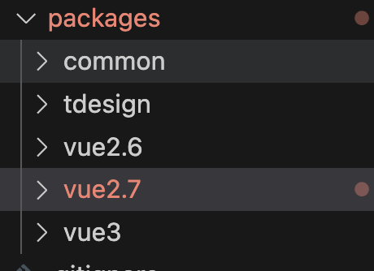

# 架构升级

## 1. 仓库模式
是否选择 Monorepo 模式

1. 现状
目前 TD 并没有使用，因为不存在多项目多应用的情况。所有的工具函数、公共组件以及配置等都只需要服务一个即可。

但做 vue23 整合需要实现类型这样的的结构。

2. 单仓工具选择
  - turbo
      以下是 Turbo 的一些主要特点和功能：

      1. 模块化开发：支持模块化开发，可以将项目拆分为多个模块，每个模块都有自己的代码和资源文件。
      2. 组件化开发：支持组件化开发，可以将 UI 界面拆分为多个组件，每个组件都有自己的样式和逻辑。
      3. 自动化构建：集成自动化构建工具，可以自动编译、压缩、合并代码和资源文件，生成最终的部署文件。
      4. 代码检查：集成代码检查工具，可以对代码进行静态检查，发现潜在的问题和错误。
      5. 集成测试：集成测试工具，可以对项目进行单元测试和集成测试，确保代码的正确性和稳定性。
      6. 自动化部署：集成自动化部署工具，可以自动将代码部署到服务器上，实现一键部署。

      总的来说，Turbo 是一个功能强大的前端单仓管理工具，可以帮助开发者更高效地管理和构建大型前端项目。

  - lerna
      Lerna 是一个前端项目管理工具，主要用于管理具有多个软件包（package）的 JavaScript 项目，特别是在处理大型的单仓库（monorepo）项目时，Lerna 能够提供强大的支持。它可以帮助你更有效地组织和管理项目中的代码，优化项目的构建、发布和依赖管理。
      1. 优化代码共享：Lerna 可以帮助你更好地组织和管理具有多个软件包的项目。当你需要在多个软件包之间共享代码时，Lerna 可以确保它们之间的依赖关系得到正确的处理。
      2. 简化依赖管理：Lerna 可以帮助你在项目中更有效地管理依赖关系。它会在项目根目录的 node_modules 文件夹中安装所有软件包的共享依赖，这样可以减少磁盘空间的使用并加快安装速度。
      3. 版本管理和发布：Lerna 可以帮助你管理项目中各个软件包的版本。你可以选择使用固定版本模式（fixed mode）或独立版本模式（independent mode）。在固定版本模式下，所有软件包共享一个版本号；在独立版本模式下，每个软件包有自己的版本号。Lerna 还可以自动发布新版本，包括生成更新日志、更新版本号、打标签、推送到远程仓库等。
      4. 执行多个软件包的脚本：Lerna 可以在所有软件包中执行相同的脚本，例如测试、构建等。这可以确保你在整个项目中保持一致的工作流程。

> 包管理工具：pnpm?

3. 冲突问题如何解决
    长时间的迁移会导致冲突剧增，届时改如何解决

4. 发包模式
  - 组件发成小包？
