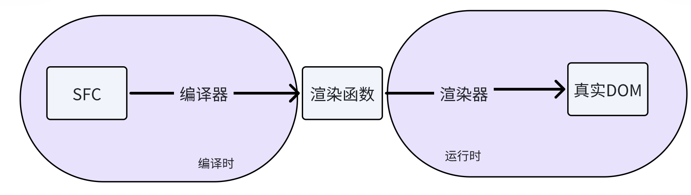

[toc]

# 探索如何用一套代码写出兼容 VUE23 的组件库

明确目的：希望能实现仅编写一套代码就能打包出能兼容 23 的效果。

> 这里不是说将 2 转换为 3，或者 3 转成 2，而是要都支持

先说结论：运行时适配。

至于为何，下面细细道来。


## 1. 能从哪些地方入手呢？

来看 vue 的整个过程。




- 源码转化
- AST 转化
- render 函数转化
- 运行时适配

## 2. 真正要兼容的是什么？

> 3 vs composition-api

### 2.1 组件库到底做了什么？

1. UI
2. 逻辑

所以，一套代码实现，包含了 UI 和逻辑。这里的逻辑不止单个组件本身的逻辑，更多的是 hooks 

### 2.2 兼容什么

1. **UI**

   - 文件格式
     - sfc 单根和多根

   - 内置组件
     - teleport 

2. **逻辑**

   - instance

     - props(3) 和 _props(2)

       > 用于 v-model

   - 函数

     - isVNode(3)

       > 用于渲染 slots

   可以看到，这种逻辑有个什么特点呢？

   它不是组件自身的所属逻辑，也不是 vue 编译的差异，<font color="red">**而是 vue 运行时所带来的差异**</font>，而我们正是需要使用这些 vue **在运行时**暴露的属性做事情（v-model 就是最好的例子）。

   


从 UI 来看

- 源码转化（可行）
- AST 转化（可行）
- render 函数转化（可行）
- 运行时适配（可行）

从逻辑来看

- 源码转化（可行）
- AST 转化（相对不可行，AST 仅有 template 的，js 的 AST 用 babel ）
- render 函数转化（不可行，render 仅包含 template）
- 运行时适配（可行，运行时的差异使用运行时来磨平即可）


## 3. 怎么做？

1. UI

   - 单根
   - 内置组件：不使用（可自行编写组件用于实现如 Teleport 的效果）

2. 逻辑

   - script setup 磨平了 vue 大部分 api 的差异

   - 其它运行时差异自行磨平

     > instance props
     >
     > 2 -> instance porps -> vue instance _porps
     >
     > 2 -> instance porps -> vue instance porps

## 4. 一些记录

- 为什么 gogocode 能做到 ast 转化而我们却不行呢？

  因为它最终的结果是确定的，不依赖运行时。**我们强依赖运行时**。

- vue2 jsx 不能在 render 函数里面返回
  这不是问题，可以 vue-preset-jsx 解决


探索 vue23 整合

## 2023.10.9 讨论

- 结论：大体采用运行时适配方案 + 编译时适配

- 遗留问题
1. props 差异
  vue2 传递 props 方式
  ```vue
  <Comp
    props={props}
  />
  ```
    vue3 传递 props 方式
  ```vue
  <Comp
    {...props}
  />
  ```

2. on 问题